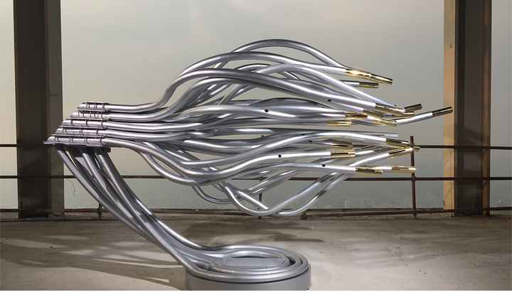
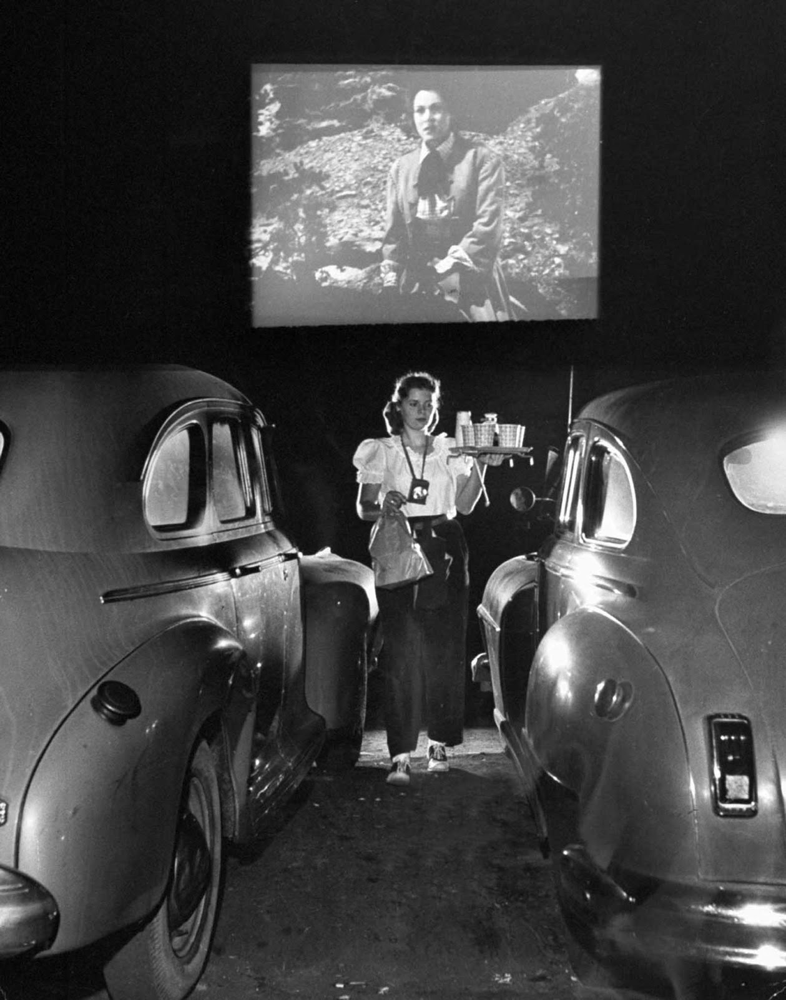

<section>
    <h1 class="NT" style="font-family:'picnic' !important;text-transform: uppercase !important;line-height: 0.9;font-size: 13rem !important;" >sound systems</h1>
</section>
<section>
    
AM

    <table class="reveal sem">
        <thead>
            <tr>
                <th class="tcol">10:00</th>
                <th class="tcol">11:00</th>
                <th class="tcol t30">11:30</th>
                <th class="tcol">13:00</th>
            </tr>
        </thead>
        <tbody>
            <tr>
                <th class="trow">VVFA</th>
                <th class="trow">Digital Lab</th>
                <th class="trow">Nicholas Mortimer</th>
                <th class="trow">Lunch</th>
            </tr>
            <tr class="bott">
                <th class="trow">Briefing</th>
                <th class="trow">Meet Karsten X Felix</th>
                <th class="trow">World of Sounds</th>
                <th class="trow">Break</th>
            </tr>
        </tbody>
    </table>
</section>
<section>
    
PM

    <table class="reveal sem">
        <thead>
            <tr>
                <th class="tcol t30">14:00</th>
                <th class="tcol">14:45</th>
                <th class="tcol t30">16:00</th>
                <th class="tcol">18:00</th>
                <th class="tcol">19:00</th>
            </tr>
        </thead>
        <tbody>
            <tr>  
                <th class="trow">Andy Law</th>
                <th class="trow">Dave Meckin</th>
                <th class="trow">Yuri Suzuki</th>
                <th class="trow">Nick Rhodes</th>
                <th class="trow">Yuri Suzuki</th>
            </tr>
            <tr>              
                <th class="trow">On Sound Sources</th>
                <th class="trow">Sound Design</th>
                <th class="trow">Sound Artist</th>
                <th class="trow">Program</th>
                <th class="trow">DJ Set</th>
            </tr>
        </tbody>
    </table>
</section>
<!-- <section data-background-color="#f0f8ff" data-state=vvfa> -->
<section data-state=vvfa>
 
    <h1 class="NT" style="font-family:'HND' !important;text-transform: uppercase !important;font-size: 13rem !important;letter-spacing: 20px;" >\'\'≠.\</h1>
</section>

<section data-background-image="assets/imgs/tc_arm.jpg" data-state=tcarm>
    
</section>

<section data-state=ls>
    
    
</section>

<section data-state=windcon>
    
    
</section>

<section data-background-image="assets/imgs/windCon_1.jpg" data-state=windcon>
    
</section>

<section data-background-image="assets/imgs/pp2.jpg" data-state=header11>

</section>

<section data-background-image="assets/imgs/pp22.jpg" data-state=header11>
</section>

<section data-background-image="assets/imgs/pp3.jpg" data-state=header11>
</section>

<section data-background-image="assets/imgs/pp4.jpg" data-state=header11>
</section>

<section data-background-image="assets/imgs/pp5.jpg" data-state=header11>
</section>

<section data-background-image="assets/imgs/pp6.jpg" data-state=header11>
</section>

<section data-background-image="assets/imgs/sho1.jpg" data-state=header12>
    
</section>

<section data-background-image="assets/imgs/sho2.jpg" data-state=header12>
</section>

<section data-background-image="assets/imgs/sho3.jpg" data-state=header12>
</section>

<section data-background-image="assets/imgs/sho4.jpg" data-state=header12>
</section>

<section data-background-image="assets/imgs/sho5.jpg" data-state=header12>
</section>

<section data-background-image="assets/imgs/sho6.jpg" data-state=header12>
</section>
<section data-state=gold>

    <iframe width="1080" height="512" src="https://www.youtube.com/embed/Qo2ntlIHKwo?si=7HRxilZnOBnG09Rc&amp;controls=0&amp;start=172" title="YouTube video player" frameborder="0" allow="accelerometer; autoplay; clipboard-write; encrypted-media; gyroscope; picture-in-picture; web-share" referrerpolicy="strict-origin-when-cross-origin" allowfullscreen></iframe>
</section>
<section data-background-image="assets/imgs/eyefi_1.jpg" data-state=eyefi>
    
</section>

<section data-background-image="assets/imgs/yokai.jpg" data-state=ono>
    
</section>

<section>
    <h1 class="BT">Cosmic Rites Fabled Soundscapes</h1>
</section>
<section data-background-color="blueviolet" data-state=header1>
    
        
<em>(Designing)</em> at the intersection of speculative fiction and anthropology, we find a sense of epistemological humility about the kind of worlds we could  or should inhabit.    We do not know what we are capable of, and yet that need not keep us from the pursuit of <em>what ifs</em>.

</section>
<section data-background-color="blueviolet" data-state=header1>
        
Through the imaginative interpellations of speculative fiction, <em>(we)</em> gravitate toward new localities and means of presence: ecological, technological <em>(social, political)</em>, Afro-futuristic <em>(African-futuristic, Indiginous-futuristic, Latinx-futuristic, Chicana-futuristic, Arab-futuristic, Sinofuturistic, Japanese-futuristic-cyberpunk, Pacific-futuristic, and so on)</em>.  Facing the imminent prospect of both disaster and discovery, they call us to resist despair and to craft tangible ways of shaping and repairing the worlds we still hope for.

</section>
<section data-state=header2>
    
    <iframe width="1080" height="512" src="https://www.youtube.com/embed/lkRSJQHlAR0?si=rPOE144y3aAFSK9E&amp;controls=0" title="YouTube video player" frameborder="0" allow="accelerometer; autoplay; clipboard-write; encrypted-media; gyroscope; picture-in-picture; web-share" referrerpolicy="strict-origin-when-cross-origin" allowfullscreen></iframe>
</section>
<section data-state=ik>
    
    <iframe width="1080" height="512" src="https://www.youtube.com/embed/60uAhggLGOM?si=kkXBncU7AbfT4hqk&amp;controls=0" title="YouTube video player" frameborder="0" allow="accelerometer; autoplay; clipboard-write; encrypted-media; gyroscope; picture-in-picture; web-share" referrerpolicy="strict-origin-when-cross-origin" allowfullscreen></iframe>
</section>
<section data-background-image="assets/imgs/arnem_1.jpg" data-state=arnem>
    
</section>
<section data-background-image="assets/imgs/arnem_2.jpg" data-state=arnem>
</section>
<section data-state=arnem>
    <iframe width="1080" height="512" src="https://www.youtube.com/embed/zEqr0jKqxMY?si=siywqlQqY57XRCKE&amp;controls=0&amp;start=2" title="YouTube video player" frameborder="0" allow="accelerometer; autoplay; clipboard-write; encrypted-media; gyroscope; picture-in-picture; web-share" referrerpolicy="strict-origin-when-cross-origin" allowfullscreen></iframe>
</section>
<section>
    <h1 class="BT">Speculative Ethnographies / Crafting Worlds From Within</h1>
</section>
<section>
    <h1 class="WP">IMAGINING OBJECTS, ARTEFACTS, RITUALS AND THINGS EMBODYING THE WORLD WITHIN WHICH THESE THINGS EXIST.</h1>
</section>
<section data-background-image="assets/imgs/Le-Guin2.jpg" data-state=kesh>
    
</section>
<section data-background-image="assets/imgs/Le-Guin2.jpg" data-state=kesh>
    <iframe style="border: 0; width: 500px; height: 400px;" src="https://bandcamp.com/EmbeddedPlayer/album=3143122306/size=large/bgcol=333333/linkcol=0f91ff/artwork=small/transparent=true/" seamless><a href="https://ursulakleguintoddbarton.bandcamp.com/album/music-and-poetry-of-the-kesh">Music and Poetry of the Kesh by Ursula K. Le Guin &amp; Todd Barton</a></iframe>
</section>
<section data-background-image="assets/imgs/golden-1.webp" data-background-opacity="1" data-state=gold>
    
</section>
<section data-background-image="assets/imgs/goldrec.webp" data-background-opacity="1" data-state=gold>
</section>
<section data-background-image="assets/imgs/goldrec.webp" data-background-opacity="1" data-state=gold>
    <iframe width="100%" height="600" scrolling="no" frameborder="no" allow="autoplay" src="https://w.soundcloud.com/player/?url=https%3A//api.soundcloud.com/playlists/129030648&color=%23f700ff&auto_play=false&hide_related=false&show_comments=true&show_user=true&show_reposts=false&show_teaser=true&visual=true"></iframe>
<a href="https://soundcloud.com/nasa" title="NASA" target="_blank" style="color: #cccccc; text-decoration: none;">NASA</a> · <a href="https://soundcloud.com/nasa/sets/golden-record-sounds-of" title="Golden Record: Sounds of Earth" target="_blank" style="color: #cccccc; text-decoration: none;">Golden Record: Sounds of Earth</a>

</section>
<section data-state=tm data-background-color="black">
    
    
</section>
<section data-background-image="assets/imgs/cs.png" data-state=cs>
    
</section>
<section data-background-image="assets/imgs/cs_2.jpg" data-state=cs>
</section>
<section data-background-image="assets/imgs/sitp_1.jpg" data-background-opacity="1" data-state=sun>
    
</section>
<section data-background-image="assets/imgs/sitp_1.jpg" data-background-opacity="1" data-state=sun>
    <iframe width="700" height="500" src="https://www.youtube.com/embed/Z8nppTSY-Rs?si=Pk8KgFlikTPCvXYa&amp;controls=0" title="YouTube video player" frameborder="0" allow="accelerometer; autoplay; clipboard-write; encrypted-media; gyroscope; picture-in-picture; web-share" referrerpolicy="strict-origin-when-cross-origin" allowfullscreen></iframe>
</section>
<section data-background-color="black" data-background-opacity="1" data-state=sun>
    <iframe width="1080" height="512" src="https://www.youtube.com/embed/owCPrIEliZc?si=SHJCzKfPKFhV_bgr&amp;controls=0" title="YouTube video player" frameborder="0" allow="accelerometer; autoplay; clipboard-write; encrypted-media; gyroscope; picture-in-picture; web-share" referrerpolicy="strict-origin-when-cross-origin" allowfullscreen></iframe>
</section>

<section data-background-color="#000000" data-state=btt>
    
    <iframe width="1080" height="512" src="https://www.youtube.com/embed/fApKGNdXhJw?si=_KjPPdZJZWl7yUf0" title="YouTube video player" frameborder="0" allow="accelerometer; autoplay; clipboard-write; encrypted-media; gyroscope; picture-in-picture; web-share" referrerpolicy="strict-origin-when-cross-origin" allowfullscreen></iframe>
</section>

<section data-background-image="assets/imgs/btt.jpg" data-state=btt>
    <a class="quotes" href="https://www.maff.tv/watch/black-to-techno">Black To Techno on maff.tv</a>
</section>

<section data-background-color="black">
    <h1 class="BT">Reverse Archaeology</h1>
</section>
<section data-background-color="#000000" data-state=header15>

    <iframe width="700" height="500" src="https://www.youtube.com/embed/ZKfOcR7Qbu4?si=PY1-X-VjGGxpOJds" title="YouTube video player" frameborder="0" allow="accelerometer; autoplay; clipboard-write; encrypted-media; gyroscope; picture-in-picture; web-share" referrerpolicy="strict-origin-when-cross-origin" allowfullscreen></iframe>
</section>
<section data-background-color="#000000" data-state=header16>

    <iframe width="700" height="500" src="https://www.youtube.com/embed/Z0lArfzw59c?si=ygsn0G2ROT8yxRpn" title="YouTube video player" frameborder="0" allow="accelerometer; autoplay; clipboard-write; encrypted-media; gyroscope; picture-in-picture; web-share" referrerpolicy="strict-origin-when-cross-origin" allowfullscreen></iframe>
</section>

<section data-background-image="assets/imgs/wfrr.jpg" data-state=wfrr>

</section>
<section data-background-image="assets/imgs/monrail.jpg" data-state=header17>

</section>

<section data-background-image="assets/imgs/pokeys.jpg" data-state=header18>

</section>

<section data-state=noidea data-background-color="black">
    
    
</section>

<section data-background-image="assets/imgs/traffic.jpg" data-state=header20>

</section>

<section data-background-image="assets/imgs/boring.png" data-state=header21>

</section>

<section data-state=header19 data-background-color="white">
    
    
</section>
<section data-background-color="black" data-background-image="assets/imgs/BIY_posters_d.png" data-state=auto>

    CRITICAL FABLES
</section>
<section data-background-color="black" >
    

    A narrative-centric design framework that employs allegorical storytelling to engage with complex issues, critique dominant paradigms, and envision alternative histories. It serves as catalyst for transformative discourse by provoking critical enquiry, ethical contemplation, and the reimagining of realities beyond conventional beliefs.
    

</section>
<section data-background-color="black" data-background-image="assets/imgs/BIY_posters.png" data-state=auto>
    
<iframe src="https://player.vimeo.com/video/339397318?badge=0&amp;autopause=0&amp;player_id=0&amp;app_id=58479" frameborder="0" allow="autoplay; fullscreen; picture-in-picture; clipboard-write" style="position:absolute;top:0;left:0;width:100%;height:100%;" title="BIY - Harmonious Self Driving Kit"></iframe>

</section>
<section data-background-color="black" data-opacity="50%" data-background-image="assets/imgs/aesop_2_d.png">
    FABLED NARRATIVE
</section>
<section data-background-color="black">
    

    A narrative featuring both human and nonhuman characters that conveys <em>a moral or lesson</em> through their actions and experiences. These narratives can explore a wide array of themes, including etiquette, ethics, societal values, personal growth, and cultural traditions.
    

</section>
<section data-background-color="black" data-background-image="assets/imgs/hertz_d.png" data-state=gh>

    CRITICAL MAKING
</section>
<section data-background-color="black">
    

        <em>Thinking is Making and Making is Thinking...</em>  
        <em>(Paraphrasing Tim Ingold)</em> The process of creation is not about imposing pre-formed ideas onto materials, but rather about a continuous "correspondence" where both the maker and the material influence and transform one another.   
    

</section>
<section data-background-color="#ff0000">
    <h1 class="BT">Objectives</h1>
</section>
<section data-background-color="#ff0000">
    

        Work in teams to design and build sonic objects that play a critical role in the world you are tasked to explore. These objects should mediate or facilitate newly emerging rituals shaped by the world’s socio-political, environmental, or technological structures.  The final outcome will be a collective soundscape performance, telling framgments of a world by showcasing how these objects interact and the rituals they enable and support. This performance, akin to a devised play, will not tell a linear story but will instead present an exploration of critical ideas.
    

</section>
<section data-background-color="#ff0000">
    <h1 class="BT">1 A System Of Emergent Rituals</h1>
</section>
<section data-background-color="#ff0000">
    

        The world you will explore is defined by the emergence of new rituals responding to shifting conditions. These rituals may not even be consciously recognised by the inhabitants as “rituals”; rather, they are everyday practices that organise life, from social etiquette to resource management and conflict resolution.  Your task is to design objects that facilitate or mediate these emerging rituals. These artefacts should be practical and integral to the functioning of the speculative world’s systems.
    

</section>
<section data-background-color="#ff0000" data-background-image="assets/imgs/ppp_d_.png" data-state=pp>

    

       ✓ A bureaucratic object designed for identity verification, playing a crucial role in organising the distribution of scarce resources or enforcing social hierarchies.
    

</section>
<section data-background-color="#ff0000" data-background-image="assets/imgs/nl_d.png" data-state=nl>

       ✓ An audio tool that facilitates communication between inhabitants and their environment, enabling them to navigate, interpret, or even manipulate natural elements for survival.
    

</section>
<section data-background-color="#ff0000" data-background-image="assets/imgs/tm_d.png" data-state=tm>

    

       ✓ A territorial marker, a device that emits signals or cues to define invisible borders, regulating who can cross into or out of various territories in a fragmented world, perhaps functioning as a key element in maintaining the power dynamics between neighbouring zones.
    

</section>
<section data-background-color="#ff0000">
    

        The objects should reflect the systems of this world (social, political, or ecological) and be deeply embedded in its ritualistic practices.
    

</section>
<section data-background-color="#ff0000">
    <h1 class="BT">2 Rituals As Everyday Construct</h1>
</section>
<section data-background-color="#ff0000">
    

        Rituals, in this brief, extend beyond traditional ceremonies and include any organised, habitual practice that forms part of the world’s social fabric. These might be daily practices, such as energy harvesting, regular communication across locations, or the management of scarce resources.  Each group is tasked with designing objects that play a pivotal role in these practical, everyday rituals. Rather than focusing on metaphorical representations, the object should serve a functional purpose within the world’s structures.
    

</section>
<section data-background-color="#ff0000" data-background-image="assets/imgs/db_d.png" data-state=db>

    

       ✓ A Conversational Coffee Machine: The communal office coffee machine begins to offer personalized drink recommendations based on the time of day and previous choices. Over time, it starts sharing quirky trivia or motivational quotes that align uncannily with employees’ current projects or moods, subtly influencing the office atmosphere.
    

  </section>
  <section data-background-color="#ff0000" data-background-image="assets/imgs/umk_d.png" data-state=umk>

    

       ✓ A Serendipity Fare Card: The public transport fare card not only handles payments but also occasionally grants random rewards—like free rides or discounts at local businesses—based on travel patterns. Commuters start to alter their routes slightly, hoping to trigger these unexpected benefits, which gradually reshapes the flow of people through the city in unpredictable ways.
    

  </section>
  <section data-background-color="#ff0000" data-background-image="assets/imgs/tobKer_d.png" data-state=lud>

    

       ✓ An Empathy Fitness Wristbands: Beyond tracking physical activity, these wristbands detect and share subtle emotional cues among wearers in close proximity. When someone nearby is stressed, the wristband gently notifies others, encouraging supportive interactions.
    

</section>
<section data-background-color="#ff0000">
    

        Your focus is to create objects that function within the speculative world’s systems, helping to ground the rituals in a practical, everyday context.
    

</section>
<section data-background-color="#ff0000">
    <h1 class="BT">3 Sound As Integral To Object Function</h1>
</section>
<section data-background-color="#ff0000">
    

        In this project, sound should not be a separate, symbolic layer but an essential part of how the object operates. The sound produced by the objects could serve functional purposes (e.g., as alarms or feedback mechanisms) or shape the experiential aspects of the ritual itself.
    

</section>
<section data-background-color="#ff0000" data-background-image="assets/imgs/sf_d.png" data-state=sf>

    

       ✓ A walking staff used by travellers that emits sounds responding to the environment. As the user moves, the staff produces gentle tones that vary based on proximity to resources like food, water, or safe shelter. When danger is near—such as unstable terrain or hazardous weather—the sounds shift to urgent, dissonant notes.
    

</section>
<section data-background-color="#ff0000" data-background-image="assets/imgs/dpk_d.png" data-state=dpk>

    

       ✓ Kitchen tools that emit sounds to indicate cooking stages. For example, a stirring spoon that changes its resonance based on the temperature or consistency of a dish. When the desired state is achieved, the spoon produces a satisfying chime.
    

</section>
<section data-background-color="#ff0000">
    

        The challenge is to ensure that sound is inseparable from the object’s function, contributing to the ritual without relying on abstraction or symbolism.
    

</section>
<section data-background-color="#ff0000">
    <h1 class="BT">4 Critical Fables Embedded In Objects X Rituals</h1>
</section>
<section data-background-color="#ff0000">
    

        The critical fables will emerge from the interaction between the designed objects and the systems they serve. As you design the objects, consider the underlying structures they reinforce or challenge, and what social or political lessons are embedded in their use.
    

</section>
<section data-background-color="#ff0000">
    

        Questions to consider:  
        ✓ What systemic issues (such as power dynamics, surveillance, or resource control) does the object engage with?
    

    

    

        ✓ Does the object solve a problem, or does it create new ones, exposing vulnerabilities in the system?
    

</section>
<section data-background-color="#ff0000">
    

        Examples:  
        ✓ A passport control device might reveal issues of surveillance and freedom of movement, raising questions about who is granted access in this environment.
    

    

    

        ✓ A territorial marker could expose power imbalances related to the distribution of resources, reflecting how certain groups or areas are marginalised.
    

</section>
<section data-background-color="#ff0000">
    

        The “lesson” of the critical fable comes through how the object functions in its world, rather than through explicit storytelling or moralising.
    

</section>
<section data-background-color="#ff0000">
    <h1 class="BT">5 Collective Soundscape</h1>
</section>
<section data-background-color="#ff0000">
    

        The final performance will feature a collective soundscape, created by the interaction of all the designed objects. Each object’s sound will respond to or affect the sounds of others, creating an emergent, collaborative sound environment. The focus is on how the objects interact within a shared space, rather than on separate, linear performances.
    

</section>
<section data-background-color="#ff0000">
    <h1 class="BT">6 Biome As Catalyst</h1>
</section>
<section data-background-color="#ff0000">
    

        The speculative world you will work within is an adaptive system, constantly responding to new challenges—whether environmental, technological, or political. Rituals evolve to help inhabitants navigate these shifts, and the objects you design will play a key role in sustaining or disrupting these rituals.  To create meaningful and impactful design interventions, it’s essential that you thoroughly read and engage with the detailed description of this world. Pay close attention to its nuances and complexities, as understanding the environment and its dynamics will inform your object’s functionality and relevance within the system.  The challenge is to design objects that both fit within this world and reflect the larger structures that shape it.
    

</section>
<section data-background-color="#ff0000">
    <h1 class="BT">Deliverables</h1>
</section>
<section data-background-color="#ff0000">
    
✓ A short description of the ritual/event, in the form of a narrative piece of writing (~250 words).

    

        
✓ A collective performance of the rituals (details about the format will be communicated as the project progresses), to take place in the Studio Theatre at Central Saint Martins.

        

        
✓ A well considered photograph of the sound making items, objects, or artefacts created.

</section>
<section>
    <a href="https://sitraka-.github.io/cosmic-fables/TheAlchemyOfRuin.html"><h1 class="BT">The Alchemy Of Ruin</h1></a>
</section>
<section>
    <h1 class="BT">3X3 Sprint</h1>
     

        3 mins — Environmental interest - pick one feature of this environment  
        3 mins — inhabitant interest - pick one inhabitant (thing, organism, etc)  
        3 mins — Action - pick action and apply;
    

    

    <table class="verb sem smal">
    <tbody>
            <tr>  
                <th class="trow">Growing</th>
                <th class="trow">Winning</th>
                <th class="trow">Eating</th>
            </tr>
            <tr>
                <th class="trow">Sleeping</th>
                <th class="trow">Waking</th>
                <th class="trow">Dying</th>
            </tr>
            <tr>
                <th class="trow">Losing</th>
                <th class="trow">Laughing</th>
                <th class="trow">Defeating</th>
            </tr>
            <tr>
                <th class="trow">Exploiting</th>
                <th class="trow">Learning</th>
                <th class="trow">Aging</th>
            </tr>
            <tr>              
                <th class="trow">Dancing</th>
                <th class="trow">Climbing</th>
                <th class="trow">Driving</th>
            </tr>
            <tr>
                <th class="trow">Building</th>
                <th class="trow">Talking</th>
                <th class="trow">Shopping</th>
            </tr>
            <tr>
                <th class="trow">Skipping</th>
                <th class="trow">Woodworking</th>
                <th class="trow">Foraging</th>
            </tr>
            <tr>    
                <th class="trow">Juggling</th>             
                <th class="trow">Stretching</th>
                <th class="trow">Sunbathing</th>
            </tr>
            <tr>
                <th class="trow">Caving</th>
                <th class="trow">Harvesting</th>
                <th class="trow">Playing</th>
            </tr>
            <tr>
                <th class="trow">Greeting</th>
                <th class="trow">Negotiating</th>
                <th class="trow">Deceiving</th>
            </tr>
            <tr>
                <th class="trow">Smelling</th>
                <th class="trow">Breathing</th>
                <th class="trow">Sweating</th>
            </tr>
        </tbody>
    </table>
</section>
<section data-background-image="assets/imgs/wb.png" data-background-size="60%">
     
✓POLICY-MAKING✓HEALTH & SAFETY

    
✓SOCIAL FABRIC✓WEALTH DISTRIBUTION

</section>